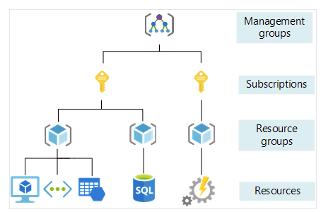
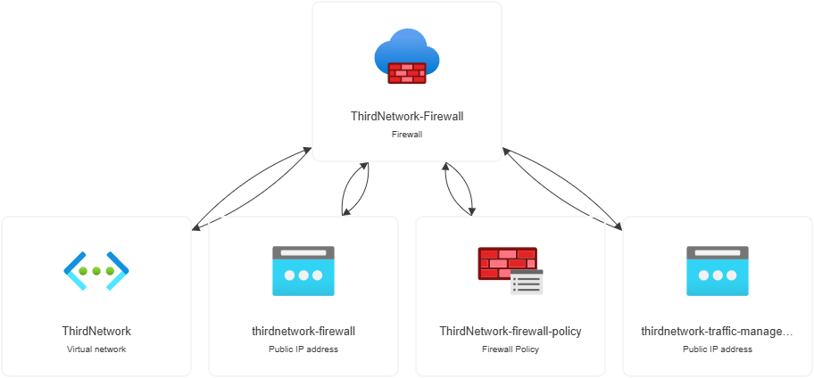

# azure_sandbox
a sandbox environment to test scripts and learn Azure

I believe the best way to learn Azure is by building a sandbox environment that mimics an enterprise setup while following Azure's official guides.

I began by creating a resource group `ThirdTimesTheCharm` (this was the third time I deleted everything and started over)

Azure is structured in the following:

Now that I have that resource group, I can create resources. I started with a virtual network and firewall.

